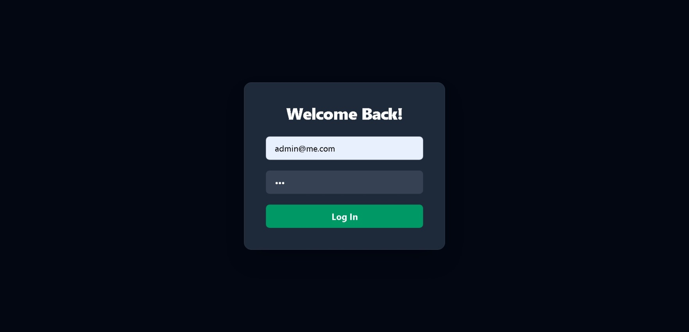
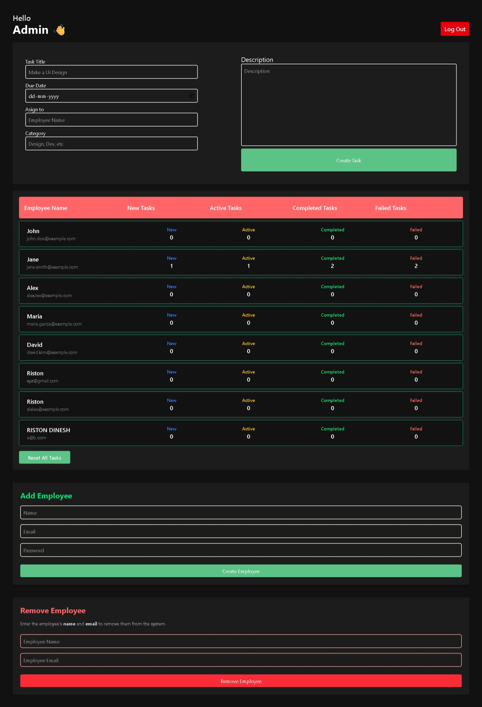
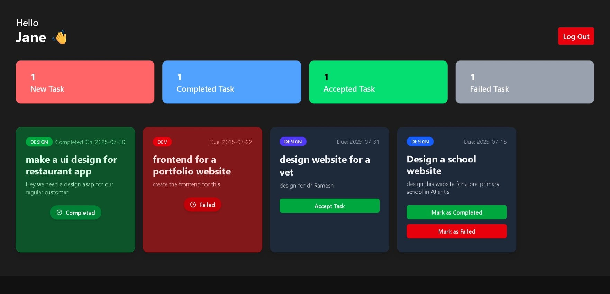

# React Employee Management System (Vite + Tailwind + LocalStorage)

A lightweight and fast admin/employee dashboard built using **React**, **Vite**, and **Tailwind CSS**. This project uses **LocalStorage** for state persistence — no backend required!

---

## Features

- ⚛️ **React** for building dynamic UIs
- ⚡ **Vite** for blazing-fast development and builds
- 🎨 **Tailwind CSS** for modern, utility-first styling
- 💾 **LocalStorage** used as a lightweight data layer (no backend)
- 🔐 Simple authentication
- ✅ Task assignment and management system
- ♻️ Real-time UI updates (no page reloads)

---

## Tech Stack

| Tool         | Purpose                         |
| ------------ | ------------------------------- |
| React        | UI Library                      |
| Vite         | Frontend Build Tool             |
| Tailwind CSS | Styling                         |
| LocalStorage | Data Storage (client-side only) |
| Prettier     | Code formatting                 |

---

## Getting Started

### 1. Clone the Repository

```bash
git clone https://github.com/yourusername/your-repo-name.git
cd your-repo-name

```

---

## project-Structure

```project-Structure
├── node_modules/               # Installed dependencies
├── public/                     # Static assets (optional)
├── src/                        # Main source code
│   ├── components/             # Reusable UI components (e.g., TaskCard, Navbar)
│   ├── context/                # React Context for Auth and App State
│   ├── pages/                  # Dashboard and Auth pages
│   │   ├── AdminDashboard.jsx
│   │   ├── EmployeeDashboard.jsx
│   │   └── Login.jsx
│   ├── utils/                  # Utility functions (e.g., localStorage handlers)
│   └── main.jsx                # App entry point
├── .gitignore
├── index.html
├── package.json
├── package-lock.json
├── prettier.config.cjs        # Prettier config
├── README.md
├── tailwind.config.js         # Tailwind setup
└── vite.config.js             # Vite configuration
```

---

## Install Dependencies

```bash
npm install
```

## start the website

```bash
npm run dev
```

---

### Default Admin Credentials

Email: admin@me.com

Password: 123
### Project Screenshots
### 🔐 Login Page


### 🧑‍💼 Admin Dashboard


### 👷 Employee Dashboard

